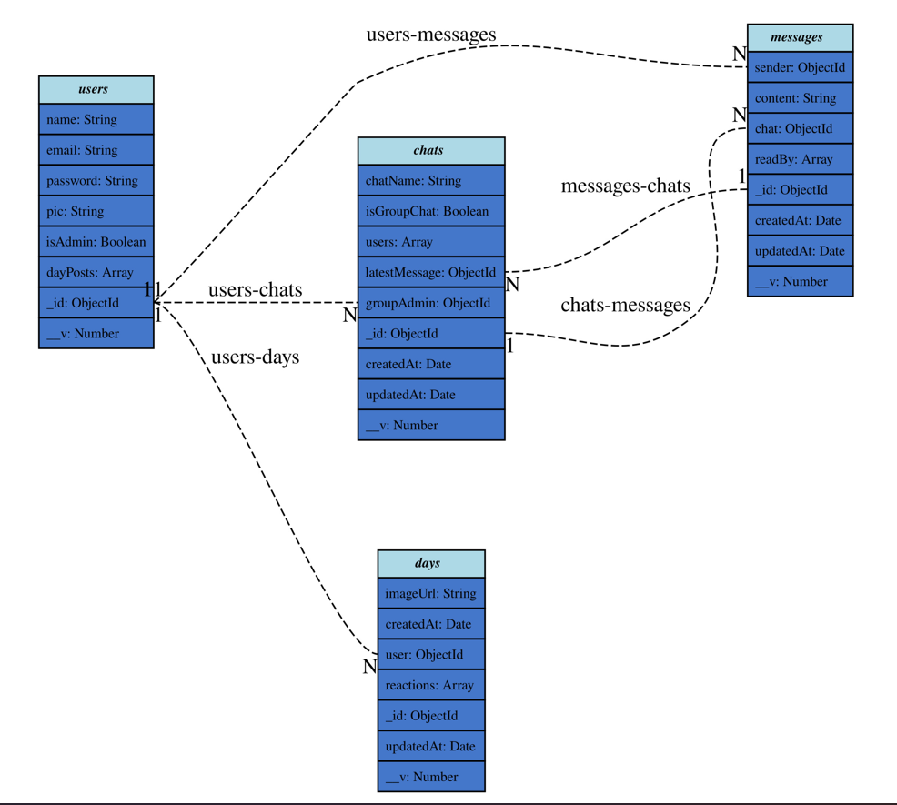

# Text
(Ongoing project...)
Text is a modern chatting web app designed to provide a seamless communication experience for users. It allows users to register or log in, create profiles, and engage in one-on-one or group chats with real-time messaging. Users can react to messages, customize chat themes, and use features like message search, read receipts, typing indicators, and notifications for new messages. The admin panel enables moderators to manage users, monitor chats for violations, and generate usage reports. With end-to-end encryption and robust data security measures, Text ensures privacy and reliability for all users.

**ERD:** 
**Live demo:** (will be available soon..)
# Demo Video

[Watch the Demo Video](https://youtu.be/KAuiT_Bp76o)


## Built with ❤️ and  
React Js,Node Js,Express js,MongoDB,Mongoose,Socket.io

## Getting Started  
Follow the step-by-step installation procedure to install and run this on your machine.

### Prerequisites  
Make sure you have Node.js installed on your device.

Node.js: Install Node.js from [here](https://nodejs.org/en/download/)

### Installation Guide  

1. **Getting the Repository**

#### Clone the Repo  
To clone the repository, use Git:

```bash
git clone https://github.com/GITMOHI/Text.git

```
2.After installation or download go to the repository and open command line

3.Install NPM packages for both client and server
```bash 
 npm install

 ```
 4.Setting up the environment (.env) file at root directory 
 
 In, server-side .env should have the followings

```bash
 FRONTEND_URL

 ```
4.Run the project
Go to your favourite code editor and run

client-side,
```bash
 npm start 
 ```

 server-side,
 ```bash
   nodemon-index.js
```
You should find that the project is working!🔥


